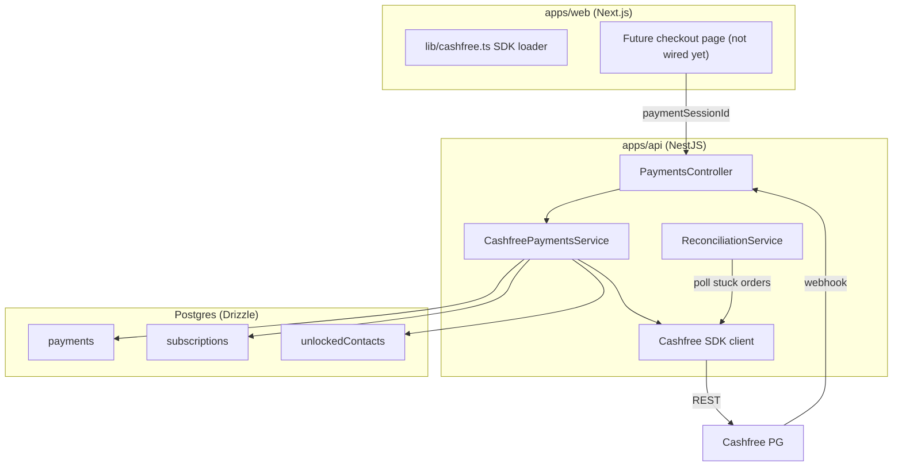

# Cashfree-Only Payment Gateway — Production Implementation Plan

## 0. Documentation review findings (Context7, Sep 2026)

Cross-checked against Cashfree's current docs (Node SDK `/cashfree/cashfree-pg-sdk-nodejs`, web SDK `/cashfree/cashfree-js`, and `www.cashfree.com/docs`). The following gaps were found and are addressed in the updated sections below.

### Critical fixes applied to this plan

1. **Webhook signature algorithm was wrong.** Original plan computed HMAC over `rawBody` only. Cashfree's spec is: `signStr = timestamp + rawBody`, then `HMAC-SHA256(signStr, clientSecret)`, then base64-encode. Headers are `x-webhook-signature` and `x-webhook-timestamp` (NOT `x-cashfree-signature` as the original plan said). See §9.3.
2. **Use the SDK's `PGVerifyWebhookSignature` instead of hand-rolled HMAC.** The Node SDK exposes `Cashfree.PGVerifyWebhookSignature(signature, rawBody, timestamp)` which returns a parsed `PGWebhookEvent` and throws on mismatch. Prefer this over manual crypto to stay aligned with SDK updates. See §9.3.
3. **Webhook replay protection.** Reject webhooks whose `x-webhook-timestamp` is older than 5 minutes (configurable) to prevent replay. Original plan missed this. See §9.3.
4. **API version bump.** Docs show the current `x-api-version` is `2026-01-01` (the user-pasted page used `2025-01-01`, but the SDK default and current docs use `2026-01-01`). Pin to `2026-01-01` and make it configurable. See §8.
5. **Idempotency key on order creation.** Cashfree supports `x-idempotency-key` header so a retried `PGCreateOrder` does not create a duplicate order. Generate a stable key per intent (e.g. `plan_${planId}_${userId}_${attempt}` or a DB row id) and pass it. Original plan did not use this. See §9.1.
6. `**x-request-id` for traceability.** Cashfree recommends sending an `x-request-id` so support can trace issues. Set this to our internal `requestId` (we already have request-id middleware). See §9.1.
7. **Return URL `order_id` collision.** Cashfree appends `order_id` to `return_url` automatically. Our plan was manually adding `&order_id=...`, which would produce a duplicate/malformed query param. Use a `return_url` template with a placeholder or no `order_id` and read it from the query string on return. See §9.1.
8. `**PGFetchOrder` returns order status, not payment id.** To get the `cf_payment_id` for a PAID order, call `PGFetchPayments` (or parse `payments[]`). Original plan guessed `order_hash` which is not the payment id. See §9.2.
9. **Webhook IP allow-list.** Cashfree publishes fixed source IPs (sandbox: `52.66.25.127`, `15.206.45.168`; prod: `52.66.101.190`, `3.109.102.144`, `18.60.134.245`, `18.60.183.142`, port 443). Add an optional IP allow-list check in front of signature verification. See §10.
10. **Rate-limit awareness.** Cashfree returns `x-ratelimit-`* headers. Implement exponential backoff on 429 and surface rate-limit state to logs. See §9.6.
11. **Order vs payment status separation.** `order_status` (`ACTIVE`/`PAID`/`EXPIRED`) and `payment_status` (`SUCCESS`/`FAILED`/`PENDING`/`FLAGGED`) are distinct. A failed payment does not immediately fail the order — the order stays `ACTIVE` until it expires or is paid. Reconciliation must treat `ACTIVE` older than the order expiry as `EXPIRED`, not `FAILED`. See §12
12. **Webhook event coverage.** Handle explicitly: `PAYMENT_SUCCESS_WEBHOOK`, `PAYMENT_FAILED_WEBHOOK`, `ORDER_PAID`, `USER_REFUNDED_WEBHOOK` (optional, log only for now), `PAYMENT_FLAGGED_WEBHOOK` (manual review — do not activate entitlement). Original plan only handled success/fail. See §9.3.
13. **Cashfree.js `load()` returns `null` on the server.** Our web loader already throws in SSR; keep that and also handle `null` explicitly (treat as "server environment" per docs, not an error to retry). See §11.
14. **Test cards / sandbox simulation.** Cashfree exposes a `POST /simulate` endpoint and published test cards for sandbox. Add these to the manual test checklist. See §15.4.

### Items confirmed already covered

- Server-side order creation with `PGCreateOrder`, server-side verification with `PGFetchOrder`.
- `payment_session_id` returned to the frontend; `cashfree.checkout({ paymentSessionId, redirectTarget })` promise result shape (`error` / `redirect` / `paymentDetails`).
- Binding orders to `userId` + `planId`/`targetProfileId` via `order_tags`.
- Idempotency on our side via unique `webhookEventId` and idempotent entitlement writes.

### Postman verification findings (official "Cashfree Payments - Direct Merchant" collection)

Cross-checked the actual request/response shapes against the official Cashfree Direct Merchant Postman collection (workspace: "Cashfree"). Additional gaps found and applied below.

1. **Full order status set.** `Get Order` docs list: `ACTIVE`, `PAID`, `EXPIRED`, `TERMINATED`, `TERMINATION_REQUESTED`. Our plan only handled ACTIVE/PAID/EXPIRED. Reconciliation must treat `TERMINATED` and `TERMINATION_REQUESTED` as terminal-failed. See §12.
2. **Full payment status set.** `Get Payment by ID` docs list: `SUCCESS`, `NOT_ATTEMPTED`, `FAILED`, `USER_DROPPED`, `VOID`, `CANCELLED`, `PENDING`. Our plan only checked `SUCCESS`. Treat `PENDING`/`NOT_ATTEMPTED` as retry-later; treat `FAILED`/`USER_DROPPED`/`VOID`/`CANCELLED` as terminal-failed. See §9.2.
3. `**order_expiry_time` is settable.** We can set an explicit expiry at order creation to bound the reconciliation window (e.g., 30 min for plan purchase, 15 min for contact unlock). Add to create order. See §9.1.
4. **Terminate Order API.** `PATCH /pg/orders/{order_id}` with body `{ "order_status": "TERMINATED" }`. Reconciliation can proactively terminate abandoned orders instead of waiting for natural expiry. Status flows `TERMINATION_REQUESTED` → `TERMINATED`; cannot terminate if a successful transaction exists. See §12.
5. **Create Refund API.** `POST /pg/orders/{order_id}/refunds` with `{ refund_amount, refund_id, refund_note, refund_speed }`. Our plan only handled the refund *webhook*; we also need merchant-initiated refunds for the admin/dispute flow. See §9.7.
6. `**x-idempotency-replayed` response header.** When set to `true`, the response was replayed from a previous idempotent request — same result, no duplicate side effects on Cashfree's side. Log it; do not treat as an error. See §9.1.
7. **Idempotency error shape.** 422 with `{ "type": "idempotency_error", "code": "request_invalid" }` — occurs when reusing an idempotency key with a *different* body. Our strategy (key = orderId, deterministic body) prevents this, but we must catch and surface it clearly rather than as a generic 422. See §9.6.
8. **Rate-limit error shape.** 429 with `{ "type": "rate_limit_error", "code": "request_failed", "message": "Too many requests from IP. Check headers" }`. Confirms §9.6 backoff logic.
9. `**order_tag` vs `order_tags`.** The collection's max-fields example uses `order_tag` (singular) but the response example and official docs use `order_tags` (plural). The singular form is a collection typo; use `order_tags` (plural). See §9.1.
10. **Auth headers on every request.** `x-client-id` + `x-client-secret` + `x-api-version` are required on every Orders/Payments/Refunds call. The Node SDK sets these globally via `Cashfree.XClientId`/`XClientSecret`/`XEnvironment`. Confirmed §8.
11. **`Get Order Extended** (`/pg/orders/{order_id}/extended`) and **Preauthorization** exist but are not needed for v1 (direct capture, no ecommerce cart). Noted for future.

### Team Postman collection confirmation (verified against "Cashfree Payments PG APIs" in "The Polaris Labs's Workspace")

The team's own Postman collection confirms the live API surface and setup schema. These are the source of truth for implementation:

- **API version**: `x-api-version: 2025-01-01` is used on **every** request in the collection (Orders, Payments, Refunds, Settlements, Subscriptions). This is the version we target. Default in config = `2025-01-01`. ✅ matches §7/§8.
- **Base URL**: `baseUrl` variable = `https://sandbox.cashfree.com/pg` (sandbox). Production = `https://api.cashfree.com/pg`. Full paths therefore:
  - Create Order: `POST https://api.cashfree.com/pg/orders`
  - Get Order: `GET https://api.cashfree.com/pg/orders/{order_id}`
  - Get Payments for an Order: `GET https://api.cashfree.com/pg/orders/{order_id}/payments`
  - Get Payment by ID: `GET https://api.cashfree.com/pg/orders/{order_id}/payments/{cf_payment_id}`
  - Terminate Order: `PATCH https://api.cashfree.com/pg/orders/{order_id}`
  - Create Refund: `POST https://api.cashfree.com/pg/orders/{order_id}/refunds`
  - Order Pay (server-side, not used in hosted checkout): `POST https://api.cashfree.com/pg/orders/sessions`
  - The Node SDK derives these from `CFEnvironment.SANDBOX` / `CFEnvironment.PRODUCTION`, so we do NOT hardcode URLs in the service.
- **Auth headers on every call**: `x-client-id` (App ID), `x-client-secret` (Secret Key), `x-api-version`. Set globally on the SDK via `Cashfree.XClientId` / `Cashfree.XClientSecret` / `Cashfree.XEnvironment`. ✅ matches §8.
- **Credentials**: The team's collection holds sandbox test credentials (`TEST…` prefixed `x-client-id` and `x-client-secret`) as collection variables. These are sandbox-only; production keys require 2FA and must be generated in the merchant dashboard. Do NOT copy these into the repo — load from `.env` (`CASHFREE_CLIENT_ID`, `CASHFREE_CLIENT_SECRET`). The webhook secret (`CASHFREE_WEBHOOK_SECRET`) is configured separately in the merchant dashboard and is NOT in the Postman collection.
- **Create Order body** (verified identical to docs): `{ order_currency, order_id, order_amount, customer_details: { customer_id, customer_phone, … } }` with optional `order_meta { return_url, notify_url }`, `order_tags`, `order_expiry_time`, `order_note`. ✅ matches §9.1.
- **Additional endpoint groups present in the team collection** (out of v1 scope, noted for future phases):
  - **Payment Link APIs** — Create/Fetch/Cancel links, Get Orders for a link.
  - **Payment methods** — Eligible Cardless EMI, Offers, Paylater, eligible Payment Methods (for custom checkout).
  - **Offers** — Get/Create Offer (card/netbanking/EMI).
  - **Token vault** — Saved card instrument CRUD + cryptogram (for saved-card flows).
  - **Settlements** — Get All Settlements, Settlement Reconciliation, **PG Reconciliation**, Get Settlements by Order ID, Mark Order For Settlement (for finance recon).
  - **Subscriptions** — Plan, Mandate, Subscription charge/auth, Refund (for recurring membership auto-renew, a likely future feature).
  - v1 uses only: Orders (Create/Get/Terminate), Payments (Get for an order / by id), Refunds (Create + webhook), and the hosted web checkout (cashfree.js). Everything else is deferred.

## 1. Goal & scope

Replace the existing Razorpay integration with **Cashfree** as the single payment provider. The new implementation is:

- **Server-authoritative** — amounts, plans, and entitlements are always driven by our database.
- **Secure** — secrets never reach the browser; every webhook is signature-verified.
- **Resilient** — handles stuck payments, duplicate webhooks, amount mismatches, and provider discrepancies automatically.
- **Isolated from paywalls** — the adapter is built and tested, but no live `/plans`, `/checkout`, or contact-unlock UI calls it until explicitly wired.

### Non-goals

- Do **not** connect Cashfree to `/checkout`, `/plans`, or contact-unlock UI yet.
- Do **not** keep Razorpay as a fallback.

## 2. Security & correctness principles

1. **Server-side source of truth** — amounts, currencies, plan durations, and entitlement grants are loaded from our database before any Cashfree call.
2. **Never trust the client for payment status** — verification uses Cashfree server-side `PGFetchOrder` with the secret key.
3. **Webhook signature verification is mandatory** — reject any unsigned or invalid Cashfree webhook.
4. **Idempotency by design** — payment rows and webhook events use unique constraints; entitlement activation is atomic and idempotent.
5. **Bind orders to intent** — every Cashfree order carries immutable metadata (`userId`, `planId` or `targetProfileId`, `orderType`) so a paid order cannot be redirected to a different product.
6. **Discrepancy = stop + alert** — when Cashfree state and our DB disagree, flag for review instead of guessing.
7. **Observability** — every Cashfree interaction is logged with `requestId`, `orderId`, `userId`, and outcome.

## 3. Threat model


| Threat                             | Mitigation                                                                                     |
| ---------------------------------- | ---------------------------------------------------------------------------------------------- |
| Client tampers with plan/amount    | Backend re-derives amount from `plans` table; ignores client-sent amount.                      |
| Client forges payment success      | Server calls Cashfree `GET /pg/orders/{order_id}` to confirm `order_status === 'PAID'`.        |
| Webhook spoofing                   | HMAC signature verification using `CASHFREE_WEBHOOK_SECRET`; reject invalid payloads with 401. |
| Replay / duplicate webhooks        | Unique `webhookEventId` column; duplicate event IDs are ignored.                               |
| Order paid for wrong plan          | `planId` stored at order creation; verification confirms Cashfree order metadata matches.      |
| User verifies another user's order | `payments.userId` is checked on verification and webhook handling.                             |
| Stuck payment in limbo             | Reconciliation job polls Cashfree for `created` orders older than 5 minutes.                   |
| Amount/currency mismatch           | Compare Cashfree-reported amount/currency with DB row; reject activation if mismatched.        |
| Secret key leak                    | Keys live only in API env; never sent to browser; app fails closed if not configured.          |
| Double payment on one order        | One `payments` row per Cashfree order; idempotent capture ignores second attempt.              |
| User closes popup or network drops | Reconciliation + webhook eventually settle the order.                                          |


## 4. High-level architecture




## 5. Cleanup — remove Razorpay

### Files to delete

- `apps/web/src/lib/razorpay.ts`
- `apps/web/src/lib/razorpay.test.ts`

### Code to strip

- `apps/api/src/payments/payments.service.ts` — remove `Razorpay` import, `requireRazorpay()`, signature verification with `crypto`, and Razorpay-specific fields.
- `apps/api/src/payments/payments.controller.ts` — remove `razorpay*` DTO fields.
- `apps/api/src/config/payments.config.ts` — remove Razorpay env vars.
- `apps/api/test/unit/payments.service.spec.ts` — remove Razorpay mocks and tests.
- `apps/api/test/integration/payments.controller.spec.ts` — remove Razorpay tests.
- `apps/web/src/app/(dashboard)/checkout/page.tsx` — remove Razorpay import and calls (page will be updated later when paywall is wired; for now just strip the provider-specific code or keep a placeholder).
- `apps/web/src/lib/api-client.ts` — update `payments` namespace to Cashfree shape.

### Env vars to remove

- `RAZORPAY_KEY_ID`
- `RAZORPAY_KEY_SECRET`
- `RAZORPAY_WEBHOOK_SECRET`

## 6. Database changes

### 6.1 Schema update

Update `packages/database/src/schema/payments.ts`:

```ts
export const paymentProviderEnum = pgEnum('payment_provider', ['cashfree']);

export const paymentStatusEnum = pgEnum('payment_status', [
  'created',
  'authorized',
  'captured',
  'failed',
  'refunded',
]);

export const verifiedByEnum = pgEnum('verified_by', [
  'client_callback',
  'webhook',
  'reconciliation',
]);

export const payments = pgTable('payments', {
  id: uuid('id').defaultRandom().primaryKey(),
  userId: uuid('user_id')
    .notNull()
    .references(() => users.id, { onDelete: 'cascade' }),
  planId: uuid('plan_id').references(() => plans.id, { onDelete: 'cascade' }),
  targetProfileId: uuid('target_profile_id')
    .references(() => profiles.id, { onDelete: 'set null' }),

  amountPaise: integer('amount_paise').notNull(),
  currency: varchar('currency', { length: 3 }).default('INR').notNull(),

  provider: paymentProviderEnum('provider').default('cashfree').notNull(),

  // Cashfree identifiers
  providerOrderId: varchar('provider_order_id', { length: 100 }).unique(),
  providerSessionId: varchar('provider_session_id', { length: 255 }).unique(),
  providerPaymentId: varchar('provider_payment_id', { length: 100 }).unique(),
  providerStatus: varchar('provider_status', { length: 50 }),

  // Audit
  providerSignature: varchar('provider_signature', { length: 500 }),
  webhookEventId: varchar('webhook_event_id', { length: 100 }).unique(),
  verifiedBy: verifiedByEnum('verified_by'),
  failureReason: text('failure_reason'),

  // Optional: provider response snapshot for forensics
  providerMetadata: jsonb('provider_metadata'),

  createdAt: timestamp('created_at', { withTimezone: true }).defaultNow().notNull(),
  updatedAt: timestamp('updated_at', { withTimezone: true }).defaultNow().notNull(),
});
```

### 6.2 Indexes

Add via Drizzle:

```ts
// In migration SQL
CREATE INDEX idx_payments_status_created ON payments(status, created_at);
CREATE INDEX idx_payments_provider_order ON payments(provider_order_id);
CREATE INDEX idx_payments_user_status ON payments(user_id, status);
```

### 6.3 Migration

Generate and run:

```bash
pnpm db:generate
pnpm db:migrate
```

## 7. Configuration

Replace `apps/api/src/config/payments.config.ts`:

```ts
import { registerAs } from '@nestjs/config';
import { Logger } from '@nestjs/common';

const logger = new Logger('PaymentsConfig');

export default registerAs('payments', () => {
  const clientId = process.env.CASHFREE_CLIENT_ID?.trim() || '';
  const clientSecret = process.env.CASHFREE_CLIENT_SECRET?.trim() || '';
  const webhookSecret = process.env.CASHFREE_WEBHOOK_SECRET?.trim() || '';
  const environment = process.env.CASHFREE_ENVIRONMENT?.trim() || 'sandbox';
  const apiVersion = process.env.CASHFREE_API_VERSION?.trim() || '2026-01-01';
  const webhookReplayWindowMs = Number(process.env.CASHFREE_WEBHOOK_REPLAY_WINDOW_MS) || 5 * 60_000;
  const webhookIpAllowlistEnabled = process.env.PAYMENTS_WEBHOOK_IP_ALLOWLIST_ENABLED === 'true';
  const webhookIps = (process.env.CASHFREE_WEBHOOK_IPS || '')
    .split(',')
    .map((s) => s.trim())
    .filter(Boolean);

  if (!clientId || !clientSecret) {
    throw new Error(
      'Refusing to start: CASHFREE_CLIENT_ID and CASHFREE_CLIENT_SECRET are required.',
    );
  }

  if (!['sandbox', 'production'].includes(environment)) {
    throw new Error('CASHFREE_ENVIRONMENT must be "sandbox" or "production".');
  }

  if (!webhookSecret) {
    logger.warn(
      'CASHFREE_WEBHOOK_SECRET is not set. Webhook signature verification will reject all webhooks until configured.',
    );
  }

  return {
    cashfreeClientId: clientId,
    cashfreeClientSecret: clientSecret,
    cashfreeWebhookSecret: webhookSecret,
    cashfreeEnvironment: environment as 'sandbox' | 'production',
    cashfreeApiVersion: apiVersion,
    webhookReplayWindowMs,
    webhookIpAllowlistEnabled,
    cashfreeWebhookIps: webhookIps,
  };
});
```

### Required env vars

Update `.env`:

```bash
# --- Cashfree Payment Gateway ---
# Credentials: get from the team's Postman collection (sandbox TEST… keys) for dev,
# or from Merchant Dashboard → Developers → API Keys (production, requires 2FA).
# Do NOT commit these. The Postman collection variables are the source of truth for sandbox.
CASHFREE_CLIENT_ID=
CASHFREE_CLIENT_SECRET=
# Webhook secret: configured in Merchant Dashboard → Developers → Webhooks.
# NOT present in the Postman collection — must be set independently.
CASHFREE_WEBHOOK_SECRET=
CASHFREE_ENVIRONMENT=sandbox
# API version — confirmed 2025-01-01 from the team's Postman collection (all endpoints).
CASHFREE_API_VERSION=2025-01-01
# Reject webhooks whose x-webhook-timestamp is older than this (ms).
CASHFREE_WEBHOOK_REPLAY_WINDOW_MS=300000
# Optional IP allow-list for the webhook endpoint.
PAYMENTS_WEBHOOK_IP_ALLOWLIST_ENABLED=false
CASHFREE_WEBHOOK_IPS=52.66.25.127,15.206.45.168
```

> **Base URL note:** The Cashfree API base is `https://sandbox.cashfree.com/pg` (sandbox) / `https://api.cashfree.com/pg` (production). We do NOT set this in env — the Node SDK derives it from `CASHFREE_ENVIRONMENT` via `CFEnvironment.SANDBOX` / `CFEnvironment.PRODUCTION`. Full endpoint paths are verified in §0 (Team Postman collection confirmation).

## 8. Cashfree SDK setup

Install in `apps/api`:

```bash
pnpm --filter @astalakshimi/api add cashfree-pg
```

Initialize the SDK once in `CashfreePaymentsService`:

```ts
import { Cashfree, CFEnvironment } from 'cashfree-pg';

@Injectable()
export class CashfreePaymentsService {
  private readonly cashfree: Cashfree;
  private readonly logger = new Logger(CashfreePaymentsService.name);

  // Pin to the Cashfree API version. The exact version is confirmed from
  // the team's Postman collection (see §0 Postman findings). Keep configurable
  // so we can bump deliberately.
  private readonly xApiVersion: string;

  constructor(
    @Inject(DB_CLIENT) private readonly db: Database,
    private readonly configService: ConfigService,
  ) {
    Cashfree.XClientId = this.configService.getOrThrow<string>('payments.cashfreeClientId');
    Cashfree.XClientSecret = this.configService.getOrThrow<string>('payments.cashfreeClientSecret');
    Cashfree.XEnvironment =
      this.configService.get<'payments.cashfreeEnvironment'>('payments.cashfreeEnvironment') === 'production'
        ? CFEnvironment.PRODUCTION
        : CFEnvironment.SANDBOX;
    this.cashfree = new Cashfree();
    this.xApiVersion =
      this.configService.get<string>('payments.cashfreeApiVersion') || '2025-01-01';
  }
}
```

## 9. Service implementation

### 9.1 Create order

```ts
async createOrder(userId: string, planIdentifier: string) {
  // 1. Load profile
  const [profile] = await this.db
    .select()
    .from(profiles)
    .where(eq(profiles.userId, userId))
    .limit(1);
  if (!profile) throw new NotFoundException('Profile not found');

  // 2. Load plan
  const isUuid = /^[0-9a-f]{8}-[0-9a-f]{4}-[0-9a-f]{4}-[0-9a-f]{4}-[0-9a-f]{12}$/i.test(planIdentifier);
  const planCondition = isUuid ? eq(plans.id, planIdentifier) : eq(plans.slug, planIdentifier);
  const [plan] = await this.db.select().from(plans).where(planCondition).limit(1);
  if (!plan) throw new NotFoundException(`Plan '${planIdentifier}' not found`);

  const amountPaise = plan.pricePaise;

  // 3. Free plan
  if (amountPaise === 0) {
    await this.activatePlanSubscription(userId, plan);
    return {
      freeActivated: true,
      planId: plan.id,
      planSlug: plan.slug,
      planName: plan.name,
      amount: 0,
      currency: 'INR',
    };
  }

  // 4. Create Cashfree order
  const orderId = this.generateOrderId(profile.id);
  // Cashfree appends order_id to return_url automatically. Do NOT add it ourselves
  // or we get a duplicate/malformed query param. Use a clean base URL and read
  // order_id from the query string on return.
  const returnUrl = `${this.configService.getOrThrow<string>('app.frontendUrl')}/checkout/return`;

  const request = {
    order_id: orderId,
    order_amount: amountPaise / 100,
    order_currency: 'INR',
    customer_details: {
      customer_id: userId,
      customer_name: profile.fullName || '',
      customer_email: profile.email || '',
      customer_phone: profile.phone || '',
    },
    order_meta: {
      return_url: returnUrl,
      // notify_url is configured in the merchant dashboard; we set it here too
      // so sandbox test webhooks reach ngrok/cloudflared tunnels.
      notify_url: `${this.configService.getOrThrow<string>('app.apiUrl')}/payments/webhook/cashfree`,
    },
    order_note: `Plan: ${plan.slug}`,
    order_tags: {
      userId,
      planId: plan.id,
      planSlug: plan.slug,
      orderType: 'plan',
    },
    // Set an explicit expiry so the reconciliation window is bounded.
    // Default 30 min for plan purchase; configurable per order type.
    order_expiry_time: this.toIsoWithOffsetMinutes(30),
  };

  // Idempotency key: stable per (user, plan, attempt) so a retried create call
  // never produces a duplicate Cashfree order. Use the orderId itself (already
  // unique) so retries with the same orderId are deduped by Cashfree.
  const idempotencyKey = orderId;
  const requestId = this.requestId; // from RequestId middleware, if available

  let cfOrder: any;
  try {
    const response = await this.cashfree.PGCreateOrder(
      this.xApiVersion,
      request as any,
      requestId,
      idempotencyKey,
    );
    cfOrder = response.data;
    // Cashfree echoes x-idempotency-replayed=true when the response was served
    // from a previous idempotent request. Log it; it is NOT an error and there
    // are no duplicate side effects on Cashfree's side.
    const replayed = (response as any)?.headers?.['x-idempotency-replayed'];
    if (replayed === 'true' || replayed === true) {
      this.logger.log(`CreateOrder idempotency replayed for ${orderId}`);
    }
  } catch (err: any) {
    // Surface idempotency_error distinctly (reused key with a different body).
    const errType = err?.response?.data?.type;
    if (errType === 'idempotency_error') {
      this.logger.error('Cashfree idempotency_error — key reused with different body', {
        orderId, idempotencyKey, error: err?.response?.data,
      });
      throw new BadRequestException('Payment order already exists with different details');
    }
    this.logger.error('Cashfree order creation failed', {
      orderId,
      requestId,
      error: err?.response?.data || err?.message,
    });
    throw new InternalServerErrorException('Failed to create payment order');
  }

  // 5. Persist payment row
  await this.db.insert(payments).values({
    userId,
    planId: plan.id,
    amountPaise,
    currency: 'INR',
    provider: 'cashfree',
    providerOrderId: cfOrder.order_id,
    providerSessionId: cfOrder.payment_session_id,
    providerStatus: cfOrder.order_status,
    providerMetadata: { cfOrder },
    status: 'created',
  });

  return {
    orderId: cfOrder.order_id,
    paymentSessionId: cfOrder.payment_session_id,
    amount: amountPaise,
    currency: 'INR',
    planId: plan.id,
    planSlug: plan.slug,
    planName: plan.name,
  };
}

private generateOrderId(profileId: string): string {
  const ts = Date.now().toString(36);
  return `cf_${profileId.substring(0, 8)}_${ts}`;
}

// Cashfree expects order_expiry_time as an ISO-8601 string with timezone offset,
// e.g. "2026-09-28T18:00:00+05:30". Build it from now + offsetMinutes.
private toIsoWithOffsetMinutes(offsetMinutes: number): string {
  const d = new Date(Date.now() + offsetMinutes * 60_000);
  // Format as local time with +05:30 offset (IST). Use toISOString then strip Z
  // and append +05:30 for simplicity, or use a small tz formatter in production.
  const istOffset = '+05:30';
  const local = new Date(d.getTime() + 5.5 * 60 * 60_000); // shift to IST
  const iso = local.toISOString().replace('T', 'T').replace(/\.\d{3}Z$/, '');
  return `${iso}${istOffset}`;
}
```

### 9.2 Verify order

```ts
async verifyOrder(userId: string, orderId: string) {
  const [payment] = await this.db
    .select()
    .from(payments)
    .where(eq(payments.providerOrderId, orderId))
    .limit(1);

  if (!payment) throw new NotFoundException('Payment record not found');
  if (payment.userId !== userId) throw new ForbiddenException('Payment does not belong to this user');

  // Idempotent
  if (payment.status === 'captured') {
    return { success: true, message: 'Payment already processed' };
  }

  // Fetch authoritative order status from Cashfree
  let cfOrder: any;
  try {
    const response = await this.cashfree.PGFetchOrder(this.xApiVersion, orderId);
    cfOrder = response.data;
  } catch (err: any) {
    this.logger.error(`Cashfree fetch order failed for ${orderId}`, err?.response?.data || err);
    throw new InternalServerErrorException('Unable to verify payment status');
  }

  // Discrepancy checks (order_amount is in major units, convert to paise)
  const cfAmountPaise = Math.round(cfOrder.order_amount * 100);
  if (cfAmountPaise !== payment.amountPaise || cfOrder.order_currency !== payment.currency) {
    await this.flagDiscrepancy(payment.id, cfOrder, 'amount/currency mismatch');
    throw new BadRequestException('Payment amount mismatch');
  }

  // Cashfree order_status (full set per team collection Get Order docs):
  //   ACTIVE, PAID, EXPIRED, TERMINATED, TERMINATION_REQUESTED
  if (cfOrder.order_status !== 'PAID') {
    // Map terminal-failed order states explicitly so the client can show the
    // right message instead of a generic "not paid".
    const terminalFailed = ['EXPIRED', 'TERMINATED', 'TERMINATION_REQUESTED'];
    if (terminalFailed.includes(cfOrder.order_status) && payment.status !== 'failed') {
      await this.db
        .update(payments)
        .set({ status: 'failed', providerStatus: cfOrder.order_status, failureReason: `Order ${cfOrder.order_status}`, updatedAt: new Date() })
        .where(eq(payments.id, payment.id));
    }
    return {
      success: false,
      status: cfOrder.order_status,
      message: `Payment is ${cfOrder.order_status}`,
    };
  }

  // Order is PAID — fetch the actual payment entity to get cf_payment_id.
  // PGFetchOrder does NOT reliably return the payment id; order_hash is not it.
  let providerPaymentId: string | null = null;
  let paymentStatus: string | null = null;
  try {
    const paymentsResponse = await this.cashfree.PGFetchPayments(this.xApiVersion, orderId);
    const paymentEntities = paymentsResponse.data as any[];
    // Full payment_status set per team collection Get Payment by ID docs:
    //   SUCCESS, NOT_ATTEMPTED, FAILED, USER_DROPPED, VOID, CANCELLED, PENDING
    // For a PAID order, at least one payment must be SUCCESS.
    const successful = paymentEntities?.find((p) => p.payment_status === 'SUCCESS');
    providerPaymentId = successful?.cf_payment_id || null;
    paymentStatus = successful?.payment_status || null;
  } catch (err: any) {
    // Non-fatal: order is PAID, we just couldn't grab the payment id.
    this.logger.warn(`PGFetchPayments failed for ${orderId}`, err?.response?.data || err);
  }

  await this.capturePayment(payment.id, providerPaymentId, 'client_callback');

  const [plan] = await this.db.select().from(plans).where(eq(plans.id, payment.planId!)).limit(1);
  if (!plan) throw new NotFoundException('Plan not found');

  await this.activatePlanSubscription(userId, plan, payment.id);

  return { success: true, planName: plan.name, planSlug: plan.slug };
}
```

### 9.3 Webhook handler

Cashfree webhook signature spec (per docs):

- Headers: `x-webhook-signature` and `x-webhook-timestamp`.
- Signature = `base64( HMAC-SHA256( clientSecret, timestamp + rawBody ) )`.
- Always use the **raw** body, never a re-serialized JSON object.
- Reject if `x-webhook-timestamp` is older than the replay window.

Prefer the SDK's `Cashfree.PGVerifyWebhookSignature(signature, rawBody, timestamp)` which returns a parsed `PGWebhookEvent` and throws on mismatch. We still do the replay-window check ourselves before calling it.

```ts
async handleWebhook(rawBody: Buffer, headers: Record<string, string>) {
  const signature = headers['x-webhook-signature'];
  const timestamp = headers['x-webhook-timestamp'];

  if (!signature || !timestamp) {
    throw new UnauthorizedException('Missing webhook signature or timestamp');
  }

  const secret = this.configService.get<string>('payments.cashfreeWebhookSecret');
  if (!secret) {
    this.logger.warn('Webhook received but CASHFREE_WEBHOOK_SECRET not configured');
    throw new UnauthorizedException('Webhook not configured');
  }

  // Replay protection: reject webhooks older than the configured window.
  const replayWindowMs =
    this.configService.get<number>('payments.webhookReplayWindowMs') ?? 5 * 60_000;
  const tsMs = Number(timestamp);
  if (!Number.isFinite(tsMs) || Math.abs(Date.now() - tsMs) > replayWindowMs) {
    this.logger.warn(`Webhook timestamp out of replay window: ${timestamp}`);
    throw new UnauthorizedException('Webhook timestamp out of replay window');
  }

  // Use the SDK verifier (preferred over hand-rolled HMAC).
  // It throws on mismatch. rawBody must be the exact bytes received.
  let webhookEvent: any;
  try {
    webhookEvent = this.cashfree.PGVerifyWebhookSignature(
      signature,
      rawBody.toString(),
      timestamp,
    );
  } catch (err: any) {
    this.logger.warn('Webhook signature verification failed', err?.message);
    throw new UnauthorizedException('Invalid webhook signature');
  }

  const payload = webhookEvent.object ?? JSON.parse(rawBody.toString());
  const eventType: string = payload.type || payload.event_type;
  const data = payload.data || payload;
  const orderId = data.order?.order_id;
  // Cashfree does not always send event_id; derive a stable id from order+type
  // so duplicates are caught by the unique constraint.
  const eventId =
    payload.event_id ||
    (data.payment?.cf_payment_id
      ? `${orderId}_${eventType}_${data.payment.cf_payment_id}`
      : `${orderId}_${eventType}`);

  // Idempotency guard
  const [existing] = await this.db
    .select({ id: payments.id })
    .from(payments)
    .where(eq(payments.webhookEventId, eventId))
    .limit(1);
  if (existing) {
    return { received: true, alreadyProcessed: true };
  }

  const [payment] = await this.db
    .select()
    .from(payments)
    .where(eq(payments.providerOrderId, orderId))
    .limit(1);

  if (!payment) {
    this.logger.warn(`Webhook for unknown order ${orderId}`);
    return { received: true, unknownOrder: true };
  }

  const cfAmountPaise = Math.round(data.order?.order_amount * 100);
  const cfCurrency = data.order?.order_currency;

  if (cfAmountPaise !== payment.amountPaise || cfCurrency !== payment.currency) {
    await this.flagDiscrepancy(payment.id, payload, 'webhook amount/currency mismatch');
    return { received: true, discrepancy: true };
  }

  switch (eventType) {
    case 'PAYMENT_SUCCESS_WEBHOOK':
    case 'ORDER_PAID': {
      if (payment.status !== 'captured') {
        const providerPaymentId = data.payment?.cf_payment_id || data.payment?.payment_id || null;
        await this.capturePayment(payment.id, providerPaymentId, 'webhook');
        const [plan] = await this.db.select().from(plans).where(eq(plans.id, payment.planId!)).limit(1);
        if (plan) await this.activatePlanSubscription(payment.userId, plan, payment.id);
      }
      break;
    }
    case 'PAYMENT_FAILED_WEBHOOK': {
      if (payment.status !== 'captured') {
        await this.db
          .update(payments)
          .set({
            status: 'failed',
            providerStatus: data.payment?.payment_status || 'FAILED',
            failureReason: data.payment?.error_message || 'Payment failed',
            updatedAt: new Date(),
          })
          .where(eq(payments.id, payment.id));
      }
      break;
    }
    case 'PAYMENT_FLAGGED_WEBHOOK': {
      // Flagged = manual review by Cashfree risk team. Do NOT activate entitlement.
      await this.flagDiscrepancy(payment.id, payload, 'payment flagged for review');
      break;
    }
    case 'USER_REFUNDED_WEBHOOK': {
      // Refund happened. Revoke entitlement if it was active.
      this.logger.warn(`Refund received for order ${orderId}`);
      await this.handleRefund(payment);
      break;
    }
    default: {
      this.logger.log(`Unhandled Cashfree webhook event: ${eventType}`);
    }
  }

  await this.db.update(payments).set({ webhookEventId: eventId }).where(eq(payments.id, payment.id));

  return { received: true };
}
```

### 9.4 Refund handler

```ts
private async handleRefund(payment: Payment) {
  // Mark payment as refunded
  await this.db
    .update(payments)
    .set({ status: 'refunded', updatedAt: new Date() })
    .where(eq(payments.id, payment.id));

  // Expire the subscription that was tied to this payment
  if (payment.planId) {
    await this.db
      .update(subscriptions)
      .set({ status: 'expired', updatedAt: new Date() })
      .where(and(eq(subscriptions.paymentId, payment.id), eq(subscriptions.status, 'active')));
  }
  // For contact-unlock refunds, leave the unlock in place (already revealed)
  // but log for manual review.
  this.logger.warn(`Refund processed for payment ${payment.id}; entitlement revoked if applicable`);
}
```

### 9.4 Helper methods

```ts
private async capturePayment(
  paymentId: string,
  providerPaymentId: string | null,
  verifiedBy: 'client_callback' | 'webhook' | 'reconciliation',
) {
  await this.db
    .update(payments)
    .set({
      status: 'captured',
      providerPaymentId,
      verifiedBy,
      updatedAt: new Date(),
    })
    .where(eq(payments.id, paymentId));
}

private async activatePlanSubscription(
  userId: string,
  plan: { id: string; durationDays: number; name: string; slug: string },
  paymentId?: string,
) {
  const startsAt = new Date();
  const expiresAt = new Date();
  expiresAt.setDate(expiresAt.getDate() + plan.durationDays);

  await this.db
    .update(subscriptions)
    .set({ status: 'expired' })
    .where(and(eq(subscriptions.userId, userId), eq(subscriptions.status, 'active')));

  await this.db.insert(subscriptions).values({
    userId,
    planId: plan.id,
    paymentId: paymentId ?? null,
    startsAt,
    expiresAt,
    status: 'active',
  });
}

private async flagDiscrepancy(paymentId: string, payload: unknown, reason: string) {
  this.logger.error(`Payment discrepancy: ${reason}`, { paymentId, payload });
  await this.db
    .update(payments)
    .set({ failureReason: reason, updatedAt: new Date() })
    .where(eq(payments.id, paymentId));
  // TODO: emit alert (Sentry/log alert)
}
```

### 9.7 Merchant-initiated refund

Cashfree exposes `POST /pg/orders/{order_id}/refunds` (verified in the team collection's Refunds → Create Refund request). This is the merchant-side refund for the admin/dispute flow — distinct from the `USER_REFUNDED_WEBHOOK` handler in §9.3 which only *receives* refund notifications.

```ts
async createRefund(input: {
  paymentId: string;          // our payments.id
  refundAmountPaise: number;  // must be <= payment.amountPaise and > 0
  refundNote?: string;
  refundSpeed?: 'STANDARD' | 'INSTANT';
  actorUserId: string;        // admin who initiated, for audit
}) {
  const [payment] = await this.db
    .select()
    .from(payments)
    .where(eq(payments.id, input.paymentId))
    .limit(1);
  if (!payment) throw new NotFoundException('Payment not found');
  if (payment.status !== 'captured') {
    throw new BadRequestException('Only captured payments can be refunded');
  }
  if (input.refundAmountPaise <= 0 || input.refundAmountPaise > payment.amountPaise) {
    throw new BadRequestException('Invalid refund amount');
  }

  const refundId = `refund_${payment.id.substring(0, 8)}_${Date.now().toString(36)}`;
  // Idempotency key = refundId so retries don't create duplicate refunds.
  const request = {
    refund_amount: input.refundAmountPaise / 100,
    refund_id: refundId,
    refund_note: input.refundNote || 'Customer dispute refund',
    refund_speed: input.refundSpeed || 'STANDARD',
  };

  let cfRefund: any;
  try {
    const response = await this.cashfree.PGCreateRefund(
      this.xApiVersion,
      payment.providerOrderId!,
      request as any,
      this.requestId,
      refundId,    );
    cfRefund = response.data;
  } catch (err: any) {
    const errType = err?.response?.data?.type;
    if (errType === 'idempotency_error') {
      throw new BadRequestException('Refund already initiated with different details');
    }
    this.logger.error('Cashfree refund creation failed', { paymentId: input.paymentId, error: err?.response?.data });
    throw new InternalServerErrorException('Failed to initiate refund');
  }

  // Record refund in a payment_refunds table (add to schema) or in providerMetadata.
  // The USER_REFUNDED_WEBHOOK handler (§9.3) will revoke entitlement when Cashfree confirms.
  this.logger.warn(`Refund ${refundId} initiated for payment ${payment.id} by ${input.actorUserId}`, {
    cfRefund,
  });

  return { refundId, status: cfRefund.refund_status, amount: input.refundAmountPaise };
}
```

Add a `payment_refunds` table (recommended) to track `refund_id`, `cf_refund_id`, `refund_status`, `refund_amount_paise`, `initiated_by`, `initiated_at`, `settled_at` for audit and reconciliation against the Settlements APIs.

> The webhook handler in §9.3 (`USER_REFUNDED_WEBHOOK`) is the source of truth for actually revoking entitlement — do **not** revoke on `createRefund` because the refund may still be pending/failed. Revoke only when the webhook confirms.

### 9.5 Contact unlock

Refactor `createContactUnlockOrder` and `verifyContactUnlockPayment` to use Cashfree directly:

```ts
async createContactUnlockOrder(userId: string, targetProfileId: string) {
  // ...validate profile/target as today...
  const amountPaise = 2900;
  const orderId = this.generateOrderId(profile.id);

  const request = {
    order_id: orderId,
    order_amount: amountPaise / 100,
    order_currency: 'INR',
    customer_details: { /* ... */ },
    order_meta: { return_url: '...', notify_url: '...' },
    order_tags: {
      userId,
      targetProfileId,
      orderType: 'contact_unlock',
    },
  };

  const response = await this.cashfree.PGCreateOrder(this.xApiVersion, request as any);
  const cfOrder = response.data;

  await this.db.insert(payments).values({
    userId,
    amountPaise,
    currency: 'INR',
    provider: 'cashfree',
    providerOrderId: cfOrder.order_id,
    providerSessionId: cfOrder.payment_session_id,
    targetProfileId,
    status: 'created',
  });

  return {
    orderId: cfOrder.order_id,
    paymentSessionId: cfOrder.payment_session_id,
    amount: amountPaise,
    currency: 'INR',
    targetProfileId,
  };
}

async verifyContactUnlockPayment(userId: string, targetProfileId: string, orderId: string) {
  const [payment] = await this.db
    .select()
    .from(payments)
    .where(eq(payments.providerOrderId, orderId))
    .limit(1);

  if (!payment) throw new NotFoundException('Payment record not found');
  if (payment.userId !== userId) throw new ForbiddenException('Payment does not belong to this user');
  if (!payment.targetProfileId) throw new BadRequestException('Payment not bound to a target profile');
  if (payment.targetProfileId !== targetProfileId) throw new BadRequestException('Target profile mismatch');

  if (payment.status === 'captured') {
    return { success: true, contactPhone: await this.resolveTargetPhone(payment.targetProfileId) };
  }

  const response = await this.cashfree.PGFetchOrder(this.xApiVersion, orderId);
  const cfOrder = response.data;

  // amount/currency checks
  if (cfOrder.order_status !== 'PAID') {
    return { success: false, status: cfOrder.order_status };
  }

  await this.capturePayment(payment.id, cfOrder.order_hash, 'client_callback');
  await this.recordContactUnlock(userId, payment.targetProfileId, payment.id);

  return { success: true, contactPhone: await this.resolveTargetPhone(payment.targetProfileId) };
}
```

## 10. Controller routes

Update `apps/api/src/payments/payments.controller.ts`:

```ts
const createOrderSchema = z.object({
  planId: z.string().min(1).max(200),
});

const verifyOrderSchema = z.object({
  orderId: z.string().min(3).max(200),
});

const contactUnlockOrderSchema = z.object({
  targetProfileId: z.string().uuid(),
});

const verifyContactUnlockSchema = z.object({
  targetProfileId: z.string().uuid(),
  orderId: z.string().min(3).max(200),
});

@UseGuards(JwtAuthGuard)
@AllowUnverified()
@Controller('payments')
export class PaymentsController {
  constructor(private readonly paymentsService: CashfreePaymentsService) {}

  @Post('orders')
  createOrder(
    @CurrentUser() user: UserSession,
    @Body(new ZodValidationPipe(createOrderSchema)) body: { planId: string },
  ) {
    return this.paymentsService.createOrder(user.userId, body.planId);
  }

  @Post('verify')
  verifyOrder(
    @CurrentUser() user: UserSession,
    @Body(new ZodValidationPipe(verifyOrderSchema)) body: { orderId: string },
  ) {
    return this.paymentsService.verifyOrder(user.userId, body.orderId);
  }

  @Get('subscription')
  getSubscription(@CurrentUser() user: UserSession) {
    return this.paymentsService.getUserSubscription(user.userId);
  }

  @Get('invoices')
  getInvoices(@CurrentUser() user: UserSession) {
    return this.paymentsService.getUserInvoices(user.userId);
  }

  @Public()
  @Post('webhook/cashfree')
  async webhook(
    @Req() req: RawBodyRequest<Request>,
    @Headers() headers: Record<string, string>,
    @Ip() ip: string,
  ) {
    // Optional IP allow-list (per Cashfree docs). Disabled in dev by config flag.
    if (this.configService.get('payments.webhookIpAllowlistEnabled') === 'true') {
      const allowlist = this.configService.get<string[]>('payments.cashfreeWebhookIps') ?? [];
      if (!allowlist.includes(ip)) {
        this.logger.warn(`Webhook from non-allowlisted IP: ${ip}`);
        throw new UnauthorizedException('IP not allowed');
      }
    }
    return this.paymentsService.handleWebhook(req.rawBody, headers);
  }
}
```

Move contact-unlock endpoints to `ContactsController` or keep in `PaymentsController` as today; if kept, update shapes to Cashfree.

### Raw body for webhooks

In `main.ts` or a dedicated middleware, ensure the raw body is captured for the webhook route **without** disabling JSON parsing for the rest of the API:

```ts
// main.ts
import { json } from 'express';

app.use(
  json({
    verify: (req: any, _res, buf) => {
      // Always capture raw body; webhook route reads req.rawBody, others ignore it.
      req.rawBody = buf;
    },
  }),
);
```

> Note: `req.rawBody` must be the **exact bytes** received. Do not re-serialize `req.body` — Cashfree's signature is computed over the original bytes.

### Cashfree webhook source IPs (for allow-list)


| Environment | IPs                                                                |
| ----------- | ------------------------------------------------------------------ |
| Sandbox     | `52.66.25.127`, `15.206.45.168`                                    |
| Production  | `52.66.101.190`, `3.109.102.144`, `18.60.134.245`, `18.60.183.142` |
| Port        | `443`                                                              |


Add to `.env` (comma-separated):

```bash
PAYMENTS_WEBHOOK_IP_ALLOWLIST_ENABLED=false
CASHFREE_WEBHOOK_IPS=52.66.25.127,15.206.45.168
```

Or use NestJS raw-body middleware.

## 11. Client-side SDK loader

Create `apps/web/src/lib/cashfree.ts`:

```ts
import { load, type Cashfree as CashfreeInstance } from '@cashfreepayments/cashfree-js';

let cashfree: CashfreeInstance | null = null;

export type CashfreeCheckoutResult =
  | { error: { message: string } }
  | { redirect: true }
  | { paymentDetails: { paymentMessage: string } };

export async function initCashfree() {
  if (typeof window === 'undefined') {
    throw new Error('Cashfree can only run in the browser.');
  }
  if (cashfree) return cashfree;

  const mode = process.env.NEXT_PUBLIC_CASHFREE_ENVIRONMENT === 'production' ? 'production' : 'sandbox';
  cashfree = await load({ mode });
  if (!cashfree) throw new Error('Cashfree SDK failed to load.');
  return cashfree;
}

export async function openCashfreeCheckout(options: {
  paymentSessionId: string;
  redirectTarget?: '_self' | '_modal' | '_blank' | '_top' | HTMLElement;
}): Promise<CashfreeCheckoutResult> {
  const cf = await initCashfree();
  return cf.checkout({
    paymentSessionId: options.paymentSessionId,
    redirectTarget: options.redirectTarget ?? '_modal',
  }) as Promise<CashfreeCheckoutResult>;
}
```

Add to `apps/web/.env.local`:

```bash
NEXT_PUBLIC_CASHFREE_ENVIRONMENT=sandbox
```

**This file is not imported by any page yet.** Wiring it into `/checkout` will be a deliberate follow-up task.

## 12. Reconciliation service

Create `apps/api/src/payments/reconciliation.service.ts`:

```ts
@Injectable()
export class ReconciliationService {
  private readonly logger = new Logger(ReconciliationService.name);

  constructor(
    @Inject(DB_CLIENT) private readonly db: Database,
    private readonly paymentsService: CashfreePaymentsService,
  ) {}

  // Trigger via @nestjs/schedule every 10 minutes, or manually
  async reconcileStuckOrders() {
    const fiveMinutesAgo = new Date(Date.now() - 5 * 60_000);
    const stuck = await this.db
      .select()
      .from(payments)
      .where(
        and(
          eq(payments.status, 'created'),
          eq(payments.provider, 'cashfree'),
          lt(payments.createdAt, fiveMinutesAgo),
        ),
      );

    for (const payment of stuck) {
      try {
        const result = await this.paymentsService.reconcileOrder(payment);
        if (result.captured) {
          this.logger.log(`Reconciliation captured order ${payment.providerOrderId}`);
        } else if (result.failed) {
          this.logger.log(`Reconciliation marked order ${payment.providerOrderId} as failed`);
        } else if (result.pending) {
          if (payment.createdAt < new Date(Date.now() - 30 * 60_000)) {
            await this.paymentsService.flagDiscrepancy(payment.id, null, 'payment stuck >30 min');
          }
        }
      } catch (err: any) {
        this.logger.error(`Reconciliation failed for ${payment.providerOrderId}`, err);
        await this.paymentsService.flagDiscrepancy(payment.id, null, `reconciliation error: ${err.message}`);
      }
    }
  }
}
```

Add `reconcileOrder` to `CashfreePaymentsService`:

```ts
async reconcileOrder(payment: Payment) {
  const response = await this.cashfree.PGFetchOrder(this.xApiVersion, payment.providerOrderId!);
  const cfOrder = response.data;

  const cfAmountPaise = Math.round(cfOrder.order_amount * 100);
  if (cfAmountPaise !== payment.amountPaise || cfOrder.order_currency !== payment.currency) {
    await this.flagDiscrepancy(payment.id, cfOrder, 'reconciliation amount/currency mismatch');
    return { discrepancy: true };
  }

  // Order status lifecycle (full set per team collection Get Order docs):
  //   ACTIVE -> PAID | EXPIRED | TERMINATED | TERMINATION_REQUESTED
  // A failed payment does NOT immediately fail the order — the order stays
  // ACTIVE until it expires, is terminated, or is paid. So:
  //   - PAID                 -> capture + activate
  //   - EXPIRED              -> mark failed (user abandoned / timed out)
  //   - TERMINATED / TERMINATION_REQUESTED -> mark failed (cancelled)
  //   - ACTIVE               -> still pending; proactively terminate if very old,
  //                              escalate to discrepancy if extremely old
  if (cfOrder.order_status === 'PAID') {
    if (payment.status !== 'captured') {
      // Fetch the actual payment id via PGFetchPayments (order_hash is NOT the payment id).
      let providerPaymentId: string | null = null;
      try {
        const paymentsResponse = await this.cashfree.PGFetchPayments(this.xApiVersion, payment.providerOrderId!);
        const paymentEntities = paymentsResponse.data as any[];
        // Only a payment_status of SUCCESS confirms capture for a PAID order.
        const successful = paymentEntities?.find((p) => p.payment_status === 'SUCCESS');
        providerPaymentId = successful?.cf_payment_id || null;
      } catch (err: any) {
        this.logger.warn(`Reconciliation PGFetchPayments failed for ${payment.providerOrderId}`, err?.response?.data || err);
      }
      await this.capturePayment(payment.id, providerPaymentId, 'reconciliation');
      if (payment.planId) {
        const [plan] = await this.db.select().from(plans).where(eq(plans.id, payment.planId)).limit(1);
        if (plan) await this.activatePlanSubscription(payment.userId, plan, payment.id);
      }
      if (payment.targetProfileId) {
        await this.recordContactUnlock(payment.userId, payment.targetProfileId, payment.id);
      }
    }
    return { captured: true };
  }

  if (['EXPIRED', 'TERMINATED', 'TERMINATION_REQUESTED'].includes(cfOrder.order_status)) {
    if (payment.status !== 'captured') {
      await this.db
        .update(payments)
        .set({ status: 'failed', providerStatus: cfOrder.order_status, failureReason: `Order ${cfOrder.order_status}`, updatedAt: new Date() })
        .where(eq(payments.id, payment.id));
    }
    return { failed: true };
  }

  // ACTIVE — still pending. If older than the proactive-terminate threshold
  // (e.g., 20 min), call Terminate Order so Cashfree stops accepting payments
  // and we don't wait for natural expiry. Then escalate if extremely old.
  const ageMs = Date.now() - payment.createdAt.getTime();
  if (ageMs > 20 * 60_000 && ageMs <= 24 * 60 * 60_000) {
    try {
      await this.cashfree.PGTerminateOrder(this.xApiVersion, payment.providerOrderId!, { order_status: 'TERMINATED' });
      this.logger.log(`Proactively terminated stale order ${payment.providerOrderId}`);
      // Do not mark failed yet — status will be TERMINATION_REQUESTED then TERMINATED;
      // the next reconciliation cycle will pick up the terminal state.
    } catch (err: any) {
      this.logger.warn(`Terminate Order failed for ${payment.providerOrderId}`, err?.response?.data || err);
    }
  }

  // ACTIVE — still pending. Reconciliation will retry next cycle.
  return { pending: true, status: cfOrder.order_status };
}
```

### Reconciliation schedule

- Run every **10 minutes** via `@nestjs/schedule` `@Cron('*/10 * * * *')`.
- Escalate to `flagDiscrepancy` when a `created` order is older than **30 minutes** and still `ACTIVE`.
- Add a hard cap: never reconcile orders older than 24 hours via this job — those need manual review (log + alert).

### 9.6 Cashfree rate-limit handling

Cashfree returns `x-ratelimit-limit`, `x-ratelimit-remaining`, `x-ratelimit-retry`, `x-ratelimit-type` headers. On a 429 response:

1. Read `x-ratelimit-retry` (seconds to wait).
2. Back off for that duration (capped at 60s).
3. Retry up to 3 times with exponential backoff.
4. If still failing, surface a 503 to the client and log `cashfree_rate_limited`.

Implement as a thin wrapper around `PGCreateOrder` / `PGFetchOrder` / `PGFetchPayments`:

```ts
private async withRateLimit<T>(op: () => Promise<T>): Promise<T> {
  let attempt = 0;
  let lastErr: any;
  while (attempt < 3) {
    try {
      return await op();
    } catch (err: any) {
      lastErr = err;
      const status = err?.response?.status;
      if (status !== 429) throw err;
      const retryAfter = Number(err?.response?.headers?.['x-ratelimit-retry']) || (2 ** attempt);
      this.logger.warn(`Cashfree rate limited; retrying in ${retryAfter}s (attempt ${attempt + 1})`);
      await new Promise((r) => setTimeout(r, Math.min(retryAfter, 60) * 1000));
      attempt++;
    }
  }
  throw new InternalServerErrorException('Cashfree rate limit exceeded');
}
```

## 13. Discrepancy table (optional but recommended)

Add `packages/database/src/schema/payment-discrepancies.ts`:

```ts
export const paymentDiscrepancies = pgTable('payment_discrepancies', {
  id: uuid('id').defaultRandom().primaryKey(),
  paymentId: uuid('payment_id')
    .notNull()
    .references(() => payments.id),
  detectedAt: timestamp('detected_at', { withTimezone: true }).defaultNow().notNull(),
  reason: text('reason').notNull(),
  providerStatus: varchar('provider_status', { length: 50 }),
  expectedAmountPaise: integer('expected_amount_paise'),
  actualAmountPaise: integer('actual_amount_paise'),
  payloadSnapshot: jsonb('payload_snapshot'),
  resolvedAt: timestamp('resolved_at', { withTimezone: true }),
  resolvedBy: varchar('resolved_by', { length: 100 }),
});
```

Update `flagDiscrepancy` to insert a row here.

## 14. API-client update

Update `apps/web/src/lib/api-client.ts` payments namespace:

```ts
payments: {
  createOrder: (planId: string) =>
    this.request<{
      orderId?: string;
      paymentSessionId?: string;
      amount?: number;
      currency?: string;
      planId?: string;
      planSlug?: string;
      planName?: string;
      freeActivated?: boolean;
    }>('/payments/orders', {
      method: 'POST',
      body: JSON.stringify({ planId }),
    }),

  verifyOrder: (data: { orderId: string }) =>
    this.request<{ success: boolean; planName?: string; planSlug?: string; message?: string; status?: string }>(
      '/payments/verify',
      { method: 'POST', body: JSON.stringify(data) },
    ),

  getSubscription: () => this.request<any>('/payments/subscription'),
  getInvoices: () => this.request<any[]>('/payments/invoices'),
},

contacts: {
  // ...existing usage endpoints...
  createPaidOrder: (targetProfileId: string) =>
    this.request<{
      orderId: string;
      paymentSessionId: string;
      amount: number;
      currency: string;
      targetProfileId: string;
    }>('/contacts/unlock/order', {
      method: 'POST',
      body: JSON.stringify({ targetProfileId }),
    }),

  verifyPaidUnlock: (data: { targetProfileId: string; orderId: string }) =>
    this.request<{ success: boolean; contactPhone?: string | null; status?: string }>(
      '/contacts/unlock/verify',
      { method: 'POST', body: JSON.stringify(data) },
    ),
}
```

## 15. Testing strategy

### 15.1 Unit tests

Rewrite `apps/api/test/unit/payments.service.spec.ts` for Cashfree:

- `createOrder`
  - throws if profile missing.
  - throws if plan missing.
  - activates free plan without calling Cashfree.
  - creates Cashfree order and inserts payment row with `providerSessionId`.
  - handles Cashfree SDK error gracefully.
- `verifyOrder`
  - throws if payment not found.
  - throws if user does not own payment.
  - returns already-processed if captured.
  - marks captured and activates subscription on `PAID`.
  - rejects amount/currency mismatch.
  - returns pending status for non-PAID orders.
- `handleWebhook`
  - rejects missing signature or timestamp.
  - rejects timestamps outside the replay window.
  - rejects invalid signature (SDK verifier throws).
  - ignores duplicate event IDs (idempotency).
  - captures payment and activates subscription on `PAYMENT_SUCCESS_WEBHOOK` / `ORDER_PAID`.
  - flags discrepancy on amount/currency mismatch.
  - marks failed on `PAYMENT_FAILED_WEBHOOK`.
  - does NOT activate entitlement on `PAYMENT_FLAGGED_WEBHOOK`; inserts discrepancy row.
  - revokes subscription and marks payment `refunded` on `USER_REFUNDED_WEBHOOK`.
  - logs and ignores unknown event types.
- `reconcileOrder`
  - captures PAID stuck orders (via `PGFetchPayments` for payment id).
  - marks EXPIRED orders as failed (not ACTIVE — order vs payment status distinction).
  - alerts on orders stuck >30 min.
  - flags discrepancy on amount/currency mismatch.
- `withRateLimit`
  - retries on 429 using `x-ratelimit-retry` header.
  - throws 503 after 3 failed attempts.
  - passes through non-429 errors immediately.

### 15.2 Integration tests

Rewrite `apps/api/test/integration/payments.controller.spec.ts`:

- `POST /payments/orders` returns Cashfree session data (mocked SDK).
- `POST /payments/verify` verifies order server-side.
- `POST /payments/webhook/cashfree` with valid signature updates DB.
- `POST /payments/webhook/cashfree` with invalid signature returns 401.

### 15.3 Web tests

Add `apps/web/src/lib/cashfree.test.ts`:

- `initCashfree` rejects on server.
- `openCashfreeCheckout` passes correct options to SDK.

### 15.4 Manual sandbox checklist

1. Set `CASHFREE_ENVIRONMENT=sandbox`.
2. Create order API returns `paymentSessionId`.
3. Use a scratch page to call `openCashfreeCheckout({ paymentSessionId })`.
4. Complete test UPI/card payment using Cashfree's published sandbox test cards (see merchant dashboard → Sandbox → Test Cards). Common ones:
  - Card: `4111 1111 1111 1111`, any future expiry, any CVV.
  - UPI: `success@cashfree` (success), `fail@cashfree` (failure).
5. Webhook hits local tunnel (ngrok/cloudflared); signature verified; subscription active.
6. Re-run verify → already processed.
7. Reconciliation no-ops for captured order.
8. Simulate amount mismatch (SDK mock) → discrepancy flagged, no entitlement.
9. Use Cashfree's `POST /simulate` endpoint (sandbox only) to trigger payment events without a real checkout, to test webhook handling in CI-like environments.
10. Replay the same webhook payload twice → second request returns `alreadyProcessed: true`, no duplicate entitlement.
11. Send a webhook with a timestamp older than the replay window → 401.
12. Send a webhook with a tampered body → 401 (signature mismatch).
13. Send a webhook from a non-allowlisted IP (with allowlist enabled) → 401.
14. Trigger `PAYMENT_FLAGGED_WEBHOOK` (sandbox simulate) → entitlement NOT activated, discrepancy row inserted.
15. Trigger `USER_REFUNDED_WEBHOOK` (sandbox simulate) → subscription revoked, payment marked `refunded`.

## 16. Monitoring & alerting

Log every Cashfree call with:

- `requestId`
- `userId`
- `providerOrderId`
- `providerSessionId`
- `endpoint` (create / fetch / webhook)
- `durationMs`
- `outcome` (success | error | pending)
- `errorCode`

Alerts:

- `payment_cashfree_error_rate > 1%`
- `payment_discrepancy` row inserted
- `payment_stuck > 30 min`
- `cashfree_webhook_signature_verification_failed`

## 17. Rollout plan

1. Merge the Cashfree-only adapter.
2. Run `pnpm db:migrate` in the target environment.
3. Configure Cashfree merchant account:
  - Generate App ID / Secret Key.
  - Whitelist production domain (Cashfree requires domain whitelisting before the SDK opens checkout).
  - Set `return_url` to `https://<domain>/checkout/return` (Cashfree appends `order_id` automatically — do NOT add it yourself).
  - Add webhook URL `https://api.<domain>/payments/webhook/cashfree`.
  - Subscribe to events: `PAYMENT_SUCCESS_WEBHOOK`, `PAYMENT_FAILED_WEBHOOK`, `ORDER_PAID`, `PAYMENT_FLAGGED_WEBHOOK`, `USER_REFUNDED_WEBHOOK`.
  - Copy webhook secret to env (`CASHFREE_WEBHOOK_SECRET`).
  - Note the production webhook source IPs and set `CASHFREE_WEBHOOK_IPS` + `PAYMENTS_WEBHOOK_IP_ALLOWLIST_ENABLED=true`.
4. Verify in sandbox with the manual checklist.
5. Switch `CASHFREE_ENVIRONMENT=production` only after sandbox is green.
6. Wire the UI in a separate follow-up task.

## 18. Key files

### New files

- `apps/api/src/payments/cashfree-payments.service.ts`
- `apps/api/src/payments/reconciliation.service.ts`
- `apps/api/test/unit/cashfree-payments.service.spec.ts`
- `apps/api/test/integration/payments.cashfree.spec.ts`
- `apps/web/src/lib/cashfree.ts`
- `apps/web/src/lib/cashfree.test.ts`
- `packages/database/src/schema/payment-discrepancies.ts`

### Modified files

- `packages/database/src/schema/payments.ts`
- `apps/api/src/config/payments.config.ts`
- `apps/api/src/payments/payments.controller.ts`
- `apps/api/src/payments/payments.module.ts`
- `apps/api/src/app.module.ts` (schedule module if using cron)
- `apps/api/test/unit/payments.service.spec.ts` (delete/rewrite)
- `apps/api/test/integration/payments.controller.spec.ts` (delete/rewrite)
- `apps/web/src/lib/api-client.ts`
- `.env` and `apps/web/.env.local`

### Deleted files

- `apps/web/src/lib/razorpay.ts`
- `apps/web/src/lib/razorpay.test.ts`
- All Razorpay-specific logic from API.

## 19. Success criteria

- [ ] Razorpay code and config fully removed.
- [ ] `CASHFREE_CLIENT_ID` + `CASHFREE_CLIENT_SECRET` required at startup.
- [ ] API version `2025-01-01` (confirmed from team Postman collection) used on every Cashfree call.
- [ ] `POST /payments/orders` creates a Cashfree order and returns `paymentSessionId`.
- [ ] `POST /payments/orders` passes `x-idempotency-key` and `x-request-id` headers; logs `x-idempotency-replayed`.
- [ ] `POST /payments/orders` sets `order_expiry_time` to bound the reconciliation window.
- [ ] `POST /payments/orders` surfaces `idempotency_error` distinctly (not as a generic 422).
- [ ] `POST /payments/verify` confirms payment via Cashfree server-side `PGFetchOrder` + `PGFetchPayments`.
- [ ] `verifyOrder` handles full order status set: ACTIVE/PAID/EXPIRED/TERMINATED/TERMINATION_REQUESTED.
- [ ] `verifyOrder` only captures when a payment entity has `payment_status === SUCCESS`.
- [ ] Webhook signature verified via SDK `PGVerifyWebhookSignature` with `timestamp + rawBody` algorithm.
- [ ] Webhook replay window enforced (reject timestamps older than 5 min).
- [ ] Webhook IP allow-list enforced when enabled.
- [ ] Webhook signature verification rejects invalid/tampered payloads.
- [ ] Duplicate webhook event IDs are ignored (idempotency).
- [ ] `PAYMENT_FLAGGED_WEBHOOK` does NOT activate entitlement (manual review).
- [ ] `USER_REFUNDED_WEBHOOK` revokes the subscription and marks payment `refunded`.
- [ ] Merchant-initiated refund (`POST /pg/orders/{order_id}/refunds`) works for admin/dispute flow.
- [ ] Amount/currency mismatch never activates an entitlement.
- [ ] Reconciliation captures stuck `PAID` orders and marks `EXPIRED`/`TERMINATED`/`TERMINATION_REQUESTED` orders as failed.
- [ ] Reconciliation proactively calls Terminate Order for stale ACTIVE orders >20 min.
- [ ] Reconciliation escalates orders stuck >30 min to discrepancy review.
- [ ] Cashfree 429 (`rate_limit_error`) responses trigger backoff and retry, never crash the request.
- [ ] All existing Razorpay tests replaced with Cashfree tests and passing.
- [ ] No live paywall/checkout page calls Cashfree until explicitly wired.