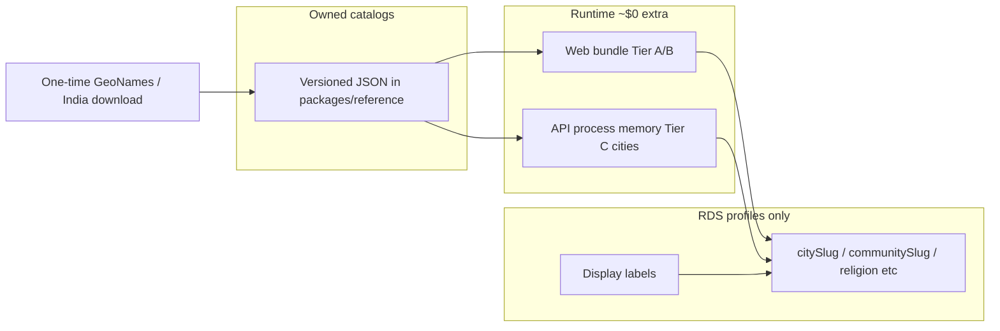

# Catalog fields — what they are, how they’re handled, and the plan

## What we researched (web search + open APIs)

From the cost-minimization discussion (EC2 + RDS + S3):

| Option | Verdict |
|--------|---------|
| **Public Nominatim** | **No** on the form path — usage policy forbids heavy autocomplete; 1 req/s; unstable IDs. Already a risky fallback in our city UI. |
| **GeoNames / Geomelon live APIs** | **No** as runtime dependency — accounts, rate limits, third-party uptime, not our IDs. |
| **Paid Places (Google / Mapbox)** | Works, but recurring cost — against cost-minimal goal. |
| **Caste / community open APIs** | **None usable** for self-declared profile data. Name→caste inference APIs are wrong for matrimony. **Curate our own JSON.** |
| **Open downloads (one-time)** | **Yes** — GeoNames India / `cities1000`, census-style India city lists → convert once into *our* `cities.json` with stable slugs. |

**Cost clarity:** RDS bill is the instance, not a few MB of lookup rows. Dropping master tables barely saves money. What keeps cost/ops low is: no Redis, no self-hosted Nominatim, no paid Places, no growing FK master-table maintenance.

**Locked approach:** versioned **JSON catalogs** + **in-memory / bundled** serving. Postgres holds **user profile data only** (slug + label), not dropdown source of truth.

---

## Catalog fields (definitive vs free text)

### Tier A — tiny curated lists (bundle in web + Zod allowlists)

| Field | Match role | Source today | Target |
|-------|------------|--------------|--------|
| `gender`, `maritalStatus`, `profileFor` | Hard / display | Zod enums | Keep (already definitive) |
| `religion` | Hard (when prefs set) | `RELIGIONS` in `profile-store.ts` | Shared `religions.json` + server allowlist |
| `motherTongue` | Soft | `MOTHER_TONGUES` in `profile-store.ts` | Shared `mother-tongues.json` + allowlist |
| `willingToRelocate` | Display | `RELOCATE_OPTIONS` | Keep small enum/list |
| `diet`, `manglik`, income bands, familyType | Soft / later | Mixed enums / selects | Same Tier A pattern when wired to match |

### Tier B — medium curated searchable (JSON, no per-keystroke API)

| Field | Match role | Source today | Target |
|-------|------------|--------------|--------|
| `caste` (community) | Soft / prefs | FE-only `community-data.ts` (~100 names); `allowCustom=true` | Shared `communities.json` with **slug + label + religion**; `allowCustom=false`; server validates slug |

### Tier C — large list (API RAM prefix search)

| Field | Match role | Source today | Target |
|-------|------------|--------------|--------|
| `city` (+ derived `state`) | Soft / prefs | Postgres `cities`/`states`/`city_aliases` (~104 cities) **+ live Nominatim** + free-typed “Use …” | Owned `cities.json` (thousands) loaded into API memory; **no Nominatim**; no free-typed city for matching |
| `country` | Display | Hardcoded `India` | Keep default India |

### Explicitly **not** catalog (free text) — done

| Field | Match | Handling |
|-------|-------|----------|
| `subcaste` | **No** | Optional free text; empty → null; display only when set |
| `gotra` | **No** | Optional free text (Hindu/Jain UI); empty → null; display only when set |
| `aboutMe`, college, company name | No | Free text |

### Already FK / master (keep as-is for now)

Education levels, specializations, occupations, companies — existing seed JSON + APIs. Out of this catalog pass unless matching needs them.

---

## How they’re handled **today** (code reality vs plan)

| Area | Plan said | Code today |
|------|-----------|------------|
| Catalog storage | JSON + memory, not RDS masters | **Mixed:** cities in **Postgres**; caste in **FE JSON**; religion/tongue in **FE constants** |
| Live geocoding | No Nominatim on form path | **Removed** — `geocoding.provider.ts` deleted; city autocomplete is catalog-only |
| Persist shape | slug + label; validate on write | **Label-only** strings; **no slug columns**; no server catalog validation for religion/caste/city |
| Subcaste / gotra | Free text | **Done** (Inputs; catalog lists removed) |
| Matching | Hard + soft on slugs | Still fake `%` / weak filters |

Unused / leftover: Postgres `communities` / `subcastes` / `gotras` tables + autocomplete APIs (profile UI no longer calls subcaste/gotra endpoints).

---

## Target architecture

### Persist rule (curated fields)
On select: write **slug + label**. Matching uses **slug equality**. Labels for cards/UI so reads don’t need the catalog.

### Validate rule
Server rejects unknown slugs for Tier A/B/C match fields. Free text fields only trim / null / max length.

---

## Implementation plan (ordered)

### Phase 0 — Confirm matching set (quick product lock)
Confirm A (hard) / B (soft) from the matching table below, then implement catalogs only for those fields.

### Phase 1 — `packages/reference` catalog package
1. Add versioned JSON: `religions`, `mother-tongues`, `communities` (religion → communities with slugs; **no** subcaste/gotra trees), `cities` (start from `india-locations.json` + expand).
2. Share types + Zod allowlists / slug checkers with web + API.
3. Load cities into Nest memory on boot; `GET /locations/cities/autocomplete` → RAM only.
4. Serve / embed community JSON for client filter (no per-keystroke community API required).

### Phase 2 — Forms + persistence
1. Religion / mother tongue / caste: selects from shared catalog; **`allowCustom=false`** for caste.
2. City autocomplete: catalog hits only; remove Nominatim + “Use typed value”.
3. Add optional `citySlug`, `communitySlug` (varchar) on `profiles` — or store slug in existing columns and keep label separately; prefer explicit slug columns.
4. Register + edit write slug+label; server validate.
5. Subcaste/gotra stay free text (already done); public/own display only when non-null (already done).

### Phase 3 — Grow cities from open data
1. Script: download GeoNames India / cities1000 (or similar), filter India, normalize aliases, emit `cities.json` with stable slugs.
2. Optional: host large file on S3; API pulls once at boot.
3. Deprecate RDS `cities`/`states`/`city_aliases` as source of truth (leave unused or drop later). Same for unused community master tables if unused.

### Phase 4 — Matching on catalogs
1. Hard filters: gender, age prefs, marital prefs, religion prefs, completeness.
2. Soft score: caste slug, city/state, motherTongue, education/income/height/diet/manglik as confirmed.
3. Apply partner preferences; delete fake name-length `%`.

---

## Proposed matching field set (still needs your confirm)

**Hard:** gender, age band, maritalStatus (prefs), religion (when prefs set), photo+basic completeness  
**Soft:** caste, city/state, motherTongue, educationLevel, income, heightCm, diet, manglik  
**Out:** subcaste, gotra, aboutMe, free-text company/college

---

## Explicitly not doing
- Postgres as source of truth for new dropdown masters / FKs for city/caste
- Live Nominatim / GeoNames / paid Places on the form path
- Free-typed values for match-critical fields
- Redis/ElastiCache just for catalogs
- Cataloging subcaste/gotra

---

## Key files
- Plan history / decisions: this file
- Existing seeds: [`packages/database/data/`](packages/database/data/) (`india-locations.json`, `community-master.json`, …)
- FE lists: [`apps/web/src/lib/community-data.ts`](apps/web/src/lib/community-data.ts), [`profile-store.ts`](apps/web/src/lib/profile-store.ts)
- City path (to replace): [`apps/api/src/locations`](apps/api/src/locations), [`city-autocomplete.tsx`](apps/web/src/components/profile/city-autocomplete.tsx)
- Community UI: [`community-fields.tsx`](apps/web/src/components/profile/community-fields.tsx)
- Fake matches: [`apps/api/src/matches/matches.service.ts`](apps/api/src/matches/matches.service.ts)
