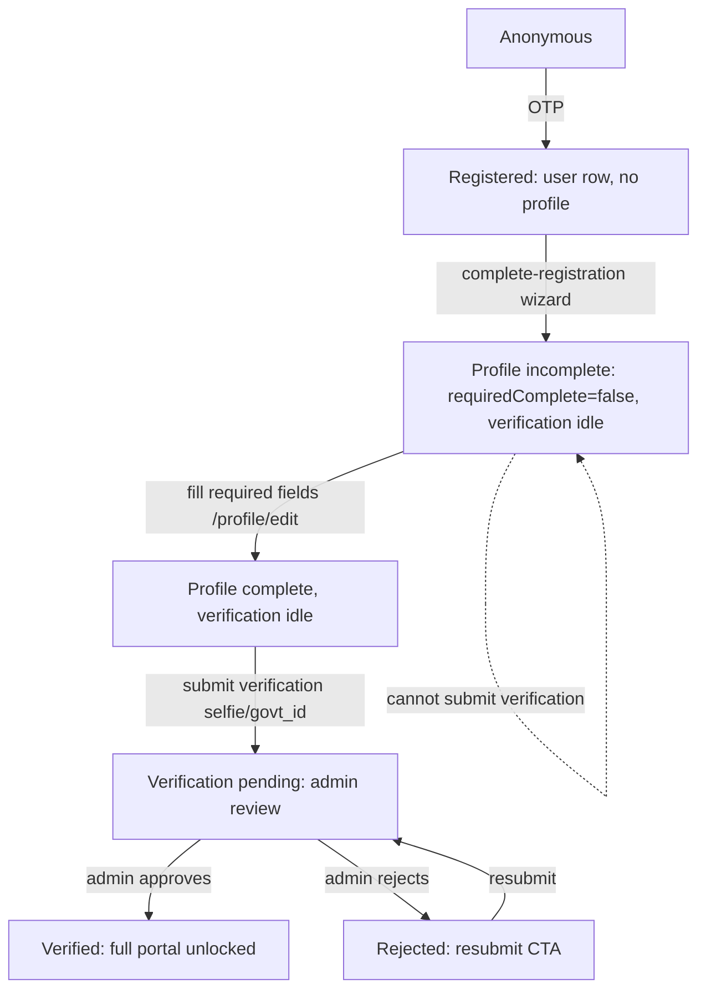

# Unified Onboarding & Verification-Gated Access

## Intended state machine

## Current-state gaps (from research)

1. `complete-registration` auto-creates `verifications.status='pending'` even when profile incomplete (career/horoscope optional) - violates the hard gate.
2. `RequireFullPortal` gates Discover on `requiredComplete` only, NOT verification - unverified-but-complete users can browse/send interests.
3. Backend has NO verification guard on interests, shortlists, chat, contacts, search - only profile-existence (`ProfileGuard`) + entitlements.
4. `CompleteProfileGate` has pending/rejected copy that is unreachable because `RequireFullPortal` only renders it when `!requiredComplete`.
5. `PROFILE_COMPLETE_THRESHOLD=80` exported but member gating uses `requiredComplete` (field set), not 80% - semantics mismatch with admin card.
6. Home inbox tiles use `canAccessFullPortal` (verified+complete) but Discover routes do not - split UX.

## Phase 1 - Backend: decouple verification submission

**[apps/api/src/profiles/profiles.service.ts](apps/api/src/profiles/profiles.service.ts)**
- In `completeRegistration` (~line 715-738): stop inserting `verifications` with `status:'pending'`. Insert with `status:'idle'` so a row exists but is not in the admin review queue. Keep storing `selfieS3Key`/`govtIdS3Key`/`method`.
- Add `submitVerification(userId)`: load profile + verification row; compute `requiredComplete` server-side (new shared helper `requiredFieldsComplete()`); if not complete throw `BadRequestException('Complete your profile before submitting for verification')`; if already `verified` throw `ConflictException`; set `status='pending'`, clear `rejectionReason`/`reviewedBy`/`reviewedAt`; return updated status.

**[apps/api/src/profiles/profiles.controller.ts](apps/api/src/profiles/profiles.controller.ts)**
- Add `@Post('me/submit-verification')` with `@AllowIncomplete()` -> calls `submitVerification`.

**[apps/api/src/media/media.service.ts](apps/api/src/media/media.service.ts)**
- `confirmVerification` (143-165): add the same `requiredComplete` check before allowing resubmit.

## Phase 2 - Backend: verification guard on interactions (not browse)

**Teaser model:** Browse endpoints (`GET /search`, `GET /matches`, `GET /profiles/:id` read view) stay open post-profile-creation so the UI can render previews. **Interaction** endpoints get the verification guard.

**New file: apps/api/src/common/guards/verification.guard.ts**
- `VerificationGuard` (global, after `ProfileGuard`): for non-`@Public`/`@AllowIncomplete`/`@Roles` routes, load user verification status (cache per request) and reject `403 "Profile verification pending - you can browse, but interactions unlock after admin verification"` unless `status === 'verified'`.
- Add `@AllowUnverified()` decorator to exempt **browse / self-service** endpoints: `GET/PATCH /profiles/me`, `POST /profiles/me/submit-verification`, `POST /media/confirm-verification`, photo upload/list, `GET /auth/me`, `GET /home/summary`, `GET /plans`, `GET /search`, `GET /matches`, `GET /profiles/:id` (read-only view), `GET /shortlists` (list - so teaser can show shortlisted state), `POST /shortlists` (shortlist toggle - allowed pre-verification per product decision), `GET /interests` (list - so UI can render sent state).

**[apps/api/src/app.module.ts](apps/api/src/app.module.ts)**
- Register `VerificationGuard` in global `APP_GUARDS` after `ProfileGuard`.

**Interaction endpoints becoming verification-gated** (NOT exempt):
- `POST /interests` (send interest), `POST /interests/:id/accept`, `POST /interests/:id/decline` - [apps/api/src/interests/interests.controller.ts](apps/api/src/interests/interests.controller.ts)
- `POST /messages`, `GET /messages/threads` (chat threads - optional: allow list, block send) - [apps/api/src/messages/messages.controller.ts](apps/api/src/messages/messages.controller.ts)
- `POST /contacts/unlock` - [apps/api/src/contacts/contacts.controller.ts](apps/api/src/contacts/contacts.controller.ts)
- `POST /profile-views` (record view - interaction signal)
- `POST /matches/:id/skip` (skip - interaction signal, if endpoint exists)

**NOT gated** (browse stays open as teaser):
- `GET /search`, `GET /matches` - exempt via `@AllowUnverified`
- `GET /profiles/:id` - exempt (read-only profile view)
- `GET /shortlists`, `POST /shortlists` - exempt (shortlist allowed pre-verification)
- `GET /interests` - exempt (list only)

## Phase 3 - Frontend: unified gate on verification (teaser, not hard lock)

**Teaser model (applies to Home + Discover):** Unverified users see scored top matches / search results **read-only**. They can open a profile preview, **shortlist** is allowed, but **send interest, accept/decline, message, unlock contact, skip** are disabled with a tooltip "Verify to interact". Full interactions unlock only after `verified`.

**[apps/web/src/lib/portal-access.ts](apps/web/src/lib/portal-access.ts)**
- Keep `isProfileComplete` = `requiredComplete`.
- Add `canInteract(data)` = `isProfileComplete(data) && isVerified(data.verificationStatus)` (replaces the previous `canBrowseMatches`-requires-verified idea; browsing stays open as teaser).
- `canBrowseMatches(data)` stays = `isProfileComplete(data)` (so Discover renders the list, not a hard gate).
- Add `canSubmitVerification(data)` = `isProfileComplete(data) && !isVerified(data.verificationStatus)`.
- Add `canShortlist(data)` = `isProfileComplete(data)` (shortlist allowed pre-verification; interactions are not).

**[apps/web/src/components/layout/require-full-portal.tsx](apps/web/src/components/layout/require-full-portal.tsx)**
- Keep using `canBrowseMatches` (= requiredComplete). When blocked by incomplete profile, render `CompleteProfileGate` with `verificationStatus` so the four-state copy is reachable.
- Do NOT hard-block on verification here (teaser shows instead).

**[apps/web/src/components/complete-profile-gate.tsx](apps/web/src/components/complete-profile-gate.tsx)**
- Accept `verificationStatus` prop; render branches:
  - `!requiredComplete` -> "Complete your profile to unlock matches" + CTA `/profile/edit`.
  - `requiredComplete && status==='idle'` -> "Submit verification to unlock interactions" + CTA to submit (still teaser-browseable).
  - `status==='pending'` -> "Verification in progress - you can browse, interactions unlock after approval" (no CTA).
  - `status==='rejected'` -> "Verification rejected - resubmit" + CTA `/profile/verify`.

**[apps/web/src/components/dashboard/match-list-card.tsx](apps/web/src/components/dashboard/match-list-card.tsx)**
- Accept `interactionsLocked` prop (default false). When true:
  - Disable the **Connect / send interest** button (`handleConnect` no-op + tooltip "Verify to send interest").
  - Disable **accept/decline** interest controls if rendered here.
  - Disable **contact unlock** button.
  - Disable **skip** (`useSkipMatchMutation`) - skip is an interaction signal.
  - Keep **shortlist toggle** enabled (`handleToggleShortlist`).
  - Keep photo carousel + profile link enabled (read-only browse).

**[apps/web/src/components/dashboard/home-match-row.tsx](apps/web/src/components/dashboard/home-match-row.tsx)**
- Already has a `locked` prop that disables interest + shortlist. Split it:
  - `locked` (incomplete profile) -> disable both interest and shortlist (current behavior).
  - `interactionsLocked` (unverified) -> disable interest only; keep shortlist enabled.
  - Pass `interactionsLocked = !canInteract(profile) && canShortlist(profile)` from Home.

## Phase 4 - Frontend: Home + Discover teaser UX states

**[apps/web/src/app/(dashboard)/home/page.tsx](apps/web/src/app/(dashboard)/home/page.tsx)**
- Compute `state = getOnboardingState(profile)`: `incomplete` | `ready_to_submit` | `pending` | `rejected` | `verified`.
- `incomplete`: amber banner + CTA "Complete profile" -> `/profile/edit`; keep top-matches preview (read-only, `interactionsLocked`).
- `ready_to_submit`: new banner "Profile complete - submit for verification" + button calling `POST /profiles/me/submit-verification`; keep teaser; disable interest buttons on preview rows.
- `pending`: amber "under review" banner; keep teaser read-only; show "What happens next?" explainer; disable interest buttons.
- `rejected`: red banner + CTA `/profile/verify`; teaser read-only.
- `verified`: full Home as today (interest + shortlist enabled).
- Pass `interactionsLocked = !canInteract(profile)` to `HomeMatchRow` for the preview rows.

**[apps/web/src/app/(dashboard)/dashboard/page.tsx](apps/web/src/app/(dashboard)/dashboard/page.tsx)**
- `DiscoverPage` stays wrapped in `RequireFullPortal` (required-complete gate).
- Inside, compute `interactionsLocked = !canInteract(profile)`.
- Pass `interactionsLocked` to `MatchListCard` for every result row.
- When `interactionsLocked`: show a slim banner at top of Discover "You're in preview mode - verify your profile to send interests / message" with CTA to submit/resubmit. Filters + pagination still work (read-only browse).
- `useSendInterestMutation` calls should be no-ops client-side when `interactionsLocked` (guard in mutation wrapper or in `handleConnect`).
- `useSkipMatchMutation` should be no-op when `interactionsLocked`.
- `useToggleShortlistMutation` stays allowed.

**[apps/web/src/hooks/queries.ts](apps/web/src/hooks/queries.ts)**
- Add `useSubmitVerificationMutation` -> `apiClient.profiles.submitVerification()` -> invalidates `profileKey`.

**[apps/web/src/lib/api-client.ts](apps/web/src/lib/api-client.ts)**
- Add `profiles.submitVerification()` -> `POST /profiles/me/submit-verification`.

## Phase 5 - Wizard wiring

**[apps/web/src/app/(auth)/register/page.tsx](apps/web/src/app/(auth)/register/page.tsx)** and **[apps/web/src/components/signup/step-verify.tsx](apps/web/src/components/signup/step-verify.tsx)**
- After `complete-registration` succeeds, call `submitVerification` (profile should be complete from wizard). On success, route to `/home` (pending state). On failure (incomplete), route to `/profile/edit` with a toast.
- `VerificationSubmitted` success screen copy: update to "Profile submitted for verification" instead of implying full access.

## Phase 6 - Admin sync

**[apps/api/src/admin/admin.service.ts](apps/api/src/admin/admin.service.ts)**
- `getPendingVerifications`: now only rows with `status='pending'` (idle rows excluded) - no change needed since it already filters `pending`.
- `getStats`: add `idleVerifications` count for the "ready to submit" population (optional admin card).

## Phase 7 - Tests

- Backend unit: `verification.guard.spec.ts`, `profiles.service.spec.ts` for `submitVerification` (complete/incomplete/already-verified/rejected-resubmit).
- Frontend unit: `portal-access.test.ts` for new `canBrowseMatches` (verified required), `canSubmitVerification`.
- E2e (Playwright): register -> land on home `incomplete` -> fill profile -> `ready_to_submit` -> submit -> `pending` -> admin approve -> `verified` -> Discover unlocked.

## Notes / decisions

- Read-only profile view (`GET /profiles/:id`) stays `@AllowUnverified` so unverified users can preview a profile from notifications if needed - OR fully lock. Default: fully lock (user chose "fully locked"), so gate it too.
- `PROFILE_COMPLETE_THRESHOLD=80` stays for admin display only; member gating uses `requiredComplete` field set (document this in code comments).
- Existing `/profile/verify` resubmit path stays for rejected users; it now also enforces `requiredComplete`.
- Staff-created profiles (admin `createProfile`) keep auto-`verified` status - unchanged.